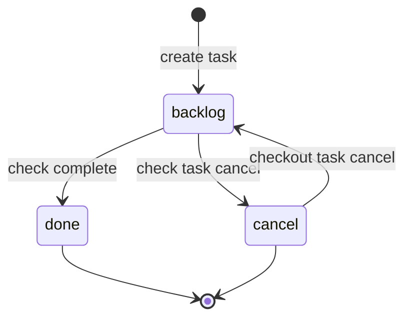

# Todo app v2

* Normal todo app.
* Create task, and assign member, and set attribute(i.g. close date, story point), and move some status (todo, do, done, cancel).

## State diagram

* At first, this app has simple state only.

## Architecture

* [layard + DDD](https://qiita.com/tono-maron/items/345c433b86f74d314c8d)